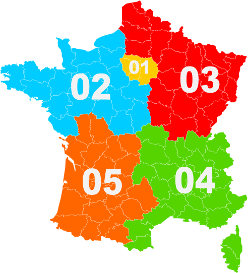

# geoguessr-tips

Tips and resources for [GeoGuessr](https://www.geoguessr.com/).

More tricks and techniques can be found on [this famous blog](https://somerandomstuff1.wordpress.com/2019/02/08/geoguessr-the-top-tips-tricks-and-techniques/)

## Coverage of Google Street View 

  - [Map maker tool](https://www.geoguessr.com/map-maker) of GeoGuessr
  - [Wikipedia page](https://en.wikipedia.org/wiki/Coverage_of_Google_Street_View)

Some countries have very limited street viewed areas. It can reduce the places to search for a city name or road number and also improve random guesses.

### Jordan

### Tunisia

Tunisia is only street viewed on the east coast

### Nigeria

### Bolivia

### Germany

Germany is only street viewed around big cities.

## Left/Right-hand traffic

Full list can be found on [wikipedia](https://en.wikipedia.org/wiki/Left-_and_right-hand_traffic).

## Google car

Some countries have a special Google car that is easy to recognize.

### Ghana

In Ghana the car has roof bars with black tape.

  

### Kenya

In Kenya the car has a snorkel.

 

### Mongolia

 

### Bangladesh

Some places in Bangladesh, but not all, have a very distinctive car with with roof bars, red mirrors, yellow and green door.

### Roof bars on the car

In several countries the Google car simply has metal bars on the roof. There are not that many countries with it so this feature and some additional context can really help identify the country. For instance spanish language + roof bars often means Guatemala.

#### Guatemala

#### Kyrgystan

#### Dominican Republic

## Nigeria

In some places of the country (not all !) the google car is followed by a police car. One of the police cars is really easy to identify because it has red and blue lights on the roof.

 

[Example on Google Street View](https://www.google.com/maps?q&layer=c&cbll=6.308179520046743,6.422759422841334)
## Languages

### How to say "street"

#### In Europe

| Country | "street"  |
|---|---|
| Albanian | rrugë |
| Bulgarian |	улица	|
| Macedonian | улица |
| Serbian | улица |
| Russian | улица |
| Ukrainian |	вулиця |
| Greek |	δρόμος |
| Catalan | carrer |
| Croatian | ulica |
| Polish | ulica |
| Slovenian |	ulica |
| Czech |	ulice |
| Hungarian |	utca |
| Lithuanian | gatvė	|
| Danish | gade |
| Norwegian |	gate |
| Swedish |	gata |
| Finnish |	katu |
| Dutch |	straat |
| Italian |	strada |
| Romanian | stradă |
| French | rue |
| Galician | rúa |
| Portuguese | rua |
| Estonian | tänav |
| German | Straße |
| Icelandic |	Götu |
| Irish |	ainm |
| Latvian | iela |
| Luxembourgish |	Strooss |
| Maltese |	triq |
| Scots Gaelic | sràid |
| Slovak | pouličné |
| Spanish |	calle |
| Welsh |	stryd |
| Turkish |	sokak |

[source](https://www.indifferentlanguages.com/words/street)

### Nordic languages

- The [Finnish alphabet](https://en.wikipedia.org/wiki/Finnish_orthography#The_extra_letters_%C3%84_and_%C3%96) has 2 extra letters: ä and ö.
- The [Danish and Norwegian alphabet](https://en.wikipedia.org/wiki/Danish_and_Norwegian_alphabet) has 3 extra letters: æ, ø and å.
- The [Swedish alphabet](https://en.wikipedia.org/wiki/Swedish_alphabet) has 3 extra letters: å, ä and ö. 

## Road signs

### USA

USA highway signs design differs from one state to another.

_source: [reddit](https://www.reddit.com/r/geoguessr/comments/inv6vy/helpful_usa_guide/) and [99percentinvisible](https://99percentinvisible.org/article/american-highways-101-visual-guide-to-u-s-road-sign-designs-numbering-systems/)_

### USA vs Canada

Signs indicating speed limits are different between the USA and Canada. In the USA the sign says "SPEED LIMIT" while in canada it says "MAXIMUM"

 
### Slovenia

The kilometer signs are very frequent in Slovenia and they also contain the road number in yellow.

### Denmark

These signs with red writting on white background and red border are only in Denmark.

## Road lines

TO DO

## Internet domains

Internet website are often found on shops, ads, trucks... If it does not end with a classic `.com` it can be really helpful to identify the country.

A complete list of Internet country code top-level domains can be found of [wikipedia](https://en.wikipedia.org/wiki/List_of_Internet_top-level_domains#Country_code_top-level_domains).

Here is a list of some tricky ones that can be seen in Geoguessr:

 - `.ae` = United Arab Emirates
 - `.ch` = Switzerland (from Confoederatio Helvetica)
 - `.cw` = Curaçao
 - `.ee` = Estonia
 - `.hr` = Croatia
 - `.lk` = Sri Lanka
 - `.rs` = Serbia
 - `.sz` = Eswatini
 - `.ua` = Ukraine
 - `.za` = South Africa (from Zuid-Afrika in Dutch)

## Phone number

### France

In France the 2 first digits of the phone number are based on the geographic area.

_source: [wikipedia](https://commons.wikimedia.org/wiki/File:Carte_indicatifs_t%C3%A9l%C3%A9phoniques_fran%C3%A7ais.svg)_
