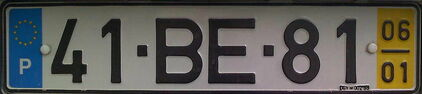

# geoguessr-tips

Tips and resources for [GeoGuessr](https://www.geoguessr.com/).

More tricks and techniques can be found on [this famous blog](https://somerandomstuff1.wordpress.com/2019/02/08/geoguessr-the-top-tips-tricks-and-techniques/)

**Table of contents**

  - [Coverage of Google Street View](#coverage-of-google-street-view)
    - [Jordan](#jordan)
    - [Tunisia](#tunisia)
    - [Nigeria](#nigeria)
    - [Bolivia](#bolivia)
    - [Germany](#germany)
  - [Left/Right-hand traffic](#leftright-hand-traffic)
  - [Google car](#google-car)
    - [Ghana](#ghana)
    - [Kenya](#kenya)
    - [Mongolia](#mongolia)
    - [Bangladesh](#bangladesh)
    - [Ukraine](#ukraine)
    - [Roof bars on the car](#roof-bars-on-the-car)
    - [Nigeria](#nigeria)
  - [Languages](#languages)
    - [Identify Asian languages](#identify-asian-languages)
    - [Identify Cyrillic languages](#identify-cyrillic-languages)
    - [How to say "street"](#how-to-say-street)
    - [Nordic languages](#nordic-languages)
    - [Baltic languages](#baltic-languages)
  - [Road signs](#road-signs)
    - [USA](#usa)
    - [USA vs Canada](#usa-vs-canada)
    - [Slovenia](#slovenia)
    - [Denmark](#denmark)
  - [Road lines](#road-lines)
    - [Nordic road lines](#nordic-road-lines)
  - [Internet domains](#internet-domains)
  - [Phone number](#phone-number)
    - [France](#france)
    - [Italy](#italy)
  - [License plates](#license-plates)
    - [Portugal license plates](#portugal-license-plates)
    - [USA front rear license plates](#USA-license-plate-mounting-scheme)
## Coverage of Google Street View 

  - [Map maker tool](https://www.geoguessr.com/map-maker) of GeoGuessr
  - [Wikipedia page](https://en.wikipedia.org/wiki/Coverage_of_Google_Street_View)

Some countries have very limited street viewed areas. It can reduce the places to search for a city name or road number and also improve random guesses.

### Jordan

### Tunisia

Tunisia is only street viewed on the east coast

### Nigeria

### Bolivia

### Germany

Germany is only street viewed around big cities.

## Left/Right-hand traffic

Full list can be found on [wikipedia](https://en.wikipedia.org/wiki/Left-_and_right-hand_traffic).

## Google car

Some countries have a special Google car that is easy to recognize.

### Ghana

In Ghana the car has roof bars with black tape.

  

### Kenya

In Kenya the car has a snorkel.

 

### Mongolia

 

### Bangladesh

Some places in Bangladesh, but not all, have a very distinctive car with with roof bars, red mirrors, yellow and green door.

### Ukraine

In Ukraine the google car is red.

[example](https://www.google.com/maps/@50.1219884,28.975738,3a,90y,296.05h,57.72t/data=!3m6!1e1!3m4!1smS90XPoCGhZoUCD1md2Lkw!2e0!7i13312!8i6656)
### Roof bars on the car

In several countries the Google car simply has metal bars on the roof. There are not that many countries with it so this feature and some additional context can really help identify the country. For instance spanish language + roof bars often means Guatemala.

#### Guatemala

#### Kyrgystan

#### Dominican Republic

#### Curaçao

### Nigeria

In some places of the country (not all !) the google car is followed by a police car. One of the police cars is really easy to identify because it has red and blue lights on the roof.

 

[Example on Google Street View](https://www.google.com/maps?q&layer=c&cbll=6.308179520046743,6.422759422841334)

## Street view year

Countries with specific year on all the pictures:

  - Croatia: 2013
## Languages

### Identify Asian languages

### Identify Cyrillic languages

### How to say "street"

#### In Europe

| Country       | "street" |
| ------------- | -------- |
| Albanian      | rrugë    |
| Bulgarian     | улица    |
| Macedonian    | улица    |
| Serbian       | улица    |
| Russian       | улица    |
| Ukrainian     | вулиця   |
| Greek         | δρόμος   |
| Catalan       | carrer   |
| Croatian      | ulica    |
| Polish        | ulica    |
| Slovenian     | ulica    |
| Czech         | ulice    |
| Hungarian     | utca     |
| Lithuanian    | gatvė    |
| Danish        | gade     |
| Norwegian     | gate     |
| Swedish       | gata     |
| Finnish       | katu     |
| Dutch         | straat   |
| Italian       | strada   |
| Romanian      | stradă   |
| French        | rue      |
| Galician      | rúa      |
| Portuguese    | rua      |
| Estonian      | tänav    |
| German        | Straße   |
| Icelandic     | Götu     |
| Irish         | ainm     |
| Latvian       | iela     |
| Luxembourgish | Strooss  |
| Maltese       | triq     |
| Scots Gaelic  | sràid    |
| Slovak        | pouličné |
| Spanish       | calle    |
| Welsh         | stryd    |
| Turkish       | sokak    |

[source](https://www.indifferentlanguages.com/words/street)

Identifying street signs can be trained by playing in no move on [this map](https://www.geoguessr.com/maps/6012fb8d348c200001fff2c4).

### Nordic languages

- The [Finnish alphabet](https://en.wikipedia.org/wiki/Finnish_orthography#The_extra_letters_%C3%84_and_%C3%96) has 2 extra letters: ä and ö.
- The [Danish and Norwegian alphabet](https://en.wikipedia.org/wiki/Danish_and_Norwegian_alphabet) has 3 extra letters: æ, ø and å.
- The [Swedish alphabet](https://en.wikipedia.org/wiki/Swedish_alphabet) has 3 extra letters: å, ä and ö.

### Baltic languages

- Latvia: aābcčdeēfgģhiījkķlļmnņoprsštuūvzž (has a with bar)
- Lithuania: aąbcčdeęėfghiįyjklmnoprsštuųūvzž (has no a with bar)
- Estonia: ABDEFGHIJKLMNOPRSŠZŽTUVÕÄÖÜ (has a with to dots above)

## Road signs

### USA

USA highway signs design differs from one state to another.

_source: [reddit](https://www.reddit.com/r/geoguessr/comments/inv6vy/helpful_usa_guide/) and [99percentinvisible](https://99percentinvisible.org/article/american-highways-101-visual-guide-to-u-s-road-sign-designs-numbering-systems/)_

### USA vs Canada

Signs indicating speed limits are different between the USA and Canada. In the USA the sign says "SPEED LIMIT" while in canada it says "MAXIMUM"

 
### Slovenia

The kilometer signs are very frequent in Slovenia and they also contain the road number in yellow.

### Denmark

These signs with red writting on white background and red border are only in Denmark.

## Road lines

### Nordic road lines

Road lines can be a good way to distinguish between nordic countries. This is not true everywhere but can be still be used.

  - In sweden, lanes on the side are made of small dashes:

  - Finland has solid side lines most of the time

  - Some places in Denmark have dotted lines with very small dots

  - Norway has a mix of solid lines and long dashes

## Internet domains

Internet website are often found on shops, ads, trucks... If it does not end with a classic `.com` it can be really helpful to identify the country.

A complete list of Internet country code top-level domains can be found of [wikipedia](https://en.wikipedia.org/wiki/List_of_Internet_top-level_domains#Country_code_top-level_domains).

Here is a list of some tricky ones that can be seen in Geoguessr:

 - `.ae` = United Arab Emirates
 - `.ch` = Switzerland (from Confoederatio Helvetica)
 - `.cw` = Curaçao
 - `.ee` = Estonia
 - `.hr` = Croatia
 - `.lk` = Sri Lanka
 - `.rs` = Serbia
 - `.sz` = Eswatini
 - `.ua` = Ukraine
 - `.za` = South Africa (from Zuid-Afrika in Dutch)

## Phone number

In many countries the first digits of the phone number are based on the geographic area.

### France

_source: [wikipedia](https://commons.wikimedia.org/wiki/File:Carte_indicatifs_t%C3%A9l%C3%A9phoniques_fran%C3%A7ais.svg)_

`06` and `07` are mobile phones

### Italy

In Italy, first digits are sorted from north to south.

_source: [Reddit](https://www.reddit.com/r/MapPorn/comments/fdivvg/you_have_a_landline_phone_in_italy_check_each)_

## License plates

### Portugal license plates

European license plates have blue on the left but Portugal is the only country with yellow on the right.

This is still visible through the blur

However, since 2020 the new plates will look more like the European standard without yellow.

See [Vehicle registration plates of Portugal](https://en.wikipedia.org/wiki/Vehicle_registration_plates_of_Portugal) article on wikipedia for more details.

### USA license plate mounting scheme

In the USA front license plates are not mandatory in all states. The map and table below illustrate each states license plate mounting scheme.

source: [wikipedia](https://upload.wikimedia.org/wikipedia/commons/2/2a/US_Vehicle_Plate_Requirements_by_State.png)

| Color | Mounting scheme                         | States  |
| ----- | -------------                           | ------- |
|  | Only rear plates required | Alabama, Arizona, Arkansas, Delaware, Florida, Georgia, Indiana, Kansas, Kentucky, Louisiana, Michigan, Mississippi, New Mexico, North Carolina, Ohio, Oklahoma, Pennsylvania, Puerto Rico, South Carolina, Tennessee, West Virginia |
|  | Front and rear plates required | Alaska, American Samoa, California, Colorado, Connecticut, District of Columbia, Hawaii, Idaho, Illinois, Iowa, Maine, Maryland, Minnesota, Missouri, New Hampshire, New Jersey, New York, North Dakota, Northern Mariana Islands, Oregon, Rhode Island, Texas, Utah, Vermont, Virgin Islands, Virginia, Washington |
|  | Front and rear generally required with Exceptions | Massachusetts, Montana, Nebraska, Nevada, South Dakota, Wyoming, Wisconsin |

See [Vehicle registration plates of the United States](https://en.wikipedia.org/wiki/Vehicle_registration_plates_of_the_United_States) article on wikipedia for more details.
